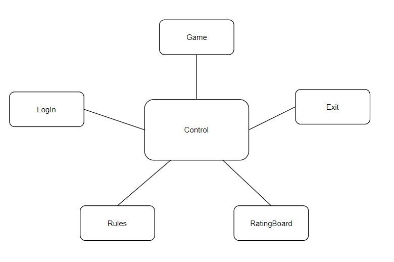
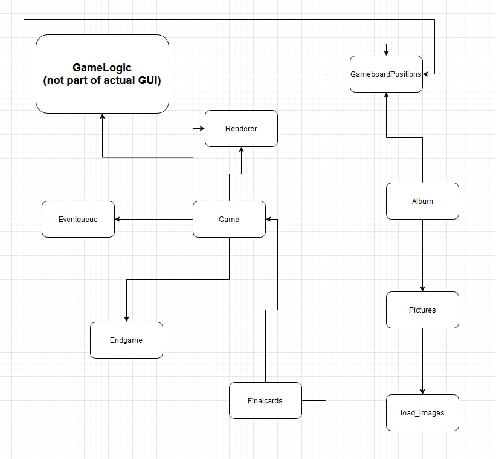
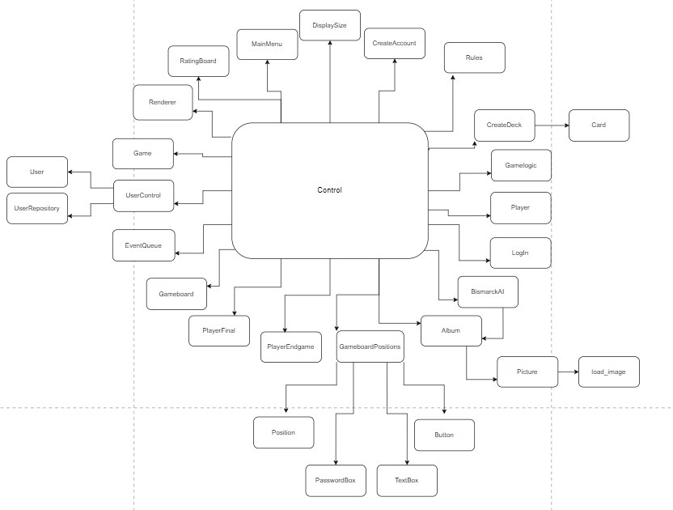

# Architecture description

- Note: Due to this programm being much more complex to develop than I initially thought it kind of snowballed and sadly I did not have time to make it perfect until the deadline. Due to this the architecture is not optimal. I will remake this entire project during the comming months. 

## Set up

The goal of the set up of Bismarck is to make it as simple as possible with only a few classes each with it's own particular concerns. The same goal applies to the folder stucture where in this case four folders are used. The first folder *ui* contains code which is used to visualize the program for the user. This folder in turn contains subfolders. The subfolder landscapes includes classes for each menu. The subfolder pictures handles everything related to pictures or to the display. The subfolder ui_services contains various classes used by the GUI. 

The second folder *services* is saved for the actual program. It contains everything the core mechanics of the game, a rulebook (GameLogic) and a simple AI (BismarckAI) to play against. The folder *entities* contians the class user which is used to store account information in. The last folder *repositories* contains a class which connects to a database where the users user-objects are stored.

## Menus

The menu system in Bismarck has a rather simple structure to it. The Control class functions as a lobby between all of the different menues. It always starts by calling the login menu since this is the first screen any user always encounters. Depending on the actions of the user the login_loop() will return either False, 2 or 3. If the return is False it simply exits the program. In other cases the return value is used as an argument for the control method "next_window()". This then decides to where the program should take you, I.E. The program always goes via the lobby (Control) and then enters the next menu. All menues use the class GameboardPositions.

## Log in or creating account

Login in to the server uses the class Login couppled with UserControl which in itself is couppled with UserRepository. The user writes a username and a password and the UserControl checks if any matches can be found in the UserRepository. 

## Actual Game

As described earlier the idea is to make the structure as stripped down as possible while still retaining a human intuitive design. In this case we have one *Card* class which is soley used to make card-objects. The *CreateDeck* class is issued to create a deck of cards, shuffle and export it for use in the *Gameboard* class. The *Gameboard* class is a class which is used to store all cards at all times in the game. In practice this means a bunch of lists from which cards are popped and appended to another list. These lists are for example *reserve_deck*, *field_deck* or *player1_hand*. After this we see the *GameLogic* class which is used to controll the *Gameboard* class in a way that the rules of the game are followed. The last class we make use of is the *Player* class which will have two instances both repressenting one of the players.

### Graphical User Interface of actual game

The GUI of the actual game follows the same philosophy as explained earlier where the ideal is to create a structure that is really simple and easy to iterate on while still maintaining a level of concreteness that suits human intuition. 

## Rules

The rules menu simply uses the renderer class to display the rules of the game.

## Ratingboard

The ratingboard menu uses the UserControl class to fetch data from the UserRepository database. 

## Architecture Map

This map lays out all classes that are connected to control from which they are then spread out to the various sub-parts of the program.

