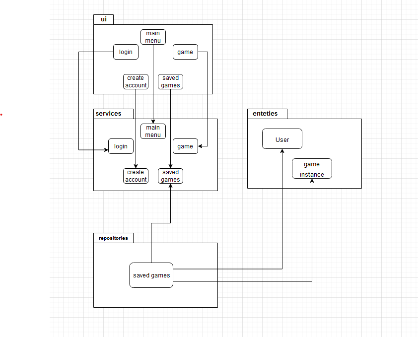
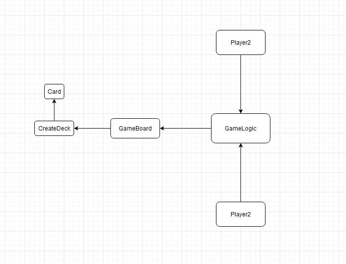

#Architecture description

##Set up

The goal of the set up of Bismarck is to make it as simple as possible with only a few classes each with it's own particular concerns. The same goal applies to the folder stucture where in this case four folders are used. The first folder *ui* contains code which is used to visualize the program for the user. The second folder *services* is saved for the actual program. The folder *entities* will contain classes for various users, be it human or AI. The last folder *repositories* will serve as a folder where the player can store "saved games" in. 

##Menus

*To be completed*

##Log in or creating account

*To be completed*

##Actual Game

As described earlier the idea is to make the structure as stripped down as possible while still retaining a human intuitive design. In this case we have one *Card* class which is soley used to make card-objects. The *CreateDeck* class is issued to create a deck of cards, shuffle and export it for use in the *Gameboard* class. The *Gameboard* class is a class which is used to store all cards at all times in the game. In practice this means a bunch of lists from which cards are popped and appended to another list. These lists are for example *reserve_deck*, *field_deck* or *player1_hand*. After this we see the *GameLogic* class which is used to controll the *Gameboard* class in a way that the rules of the game are followed. The last class we make use of is the *Player* class which will have two instances both repressenting one of the players.

##Saved Games

*To be completed*
