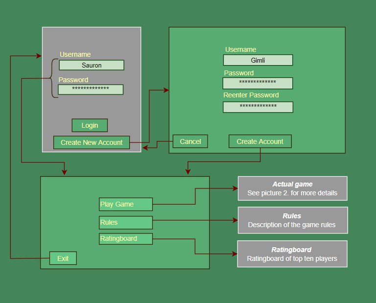
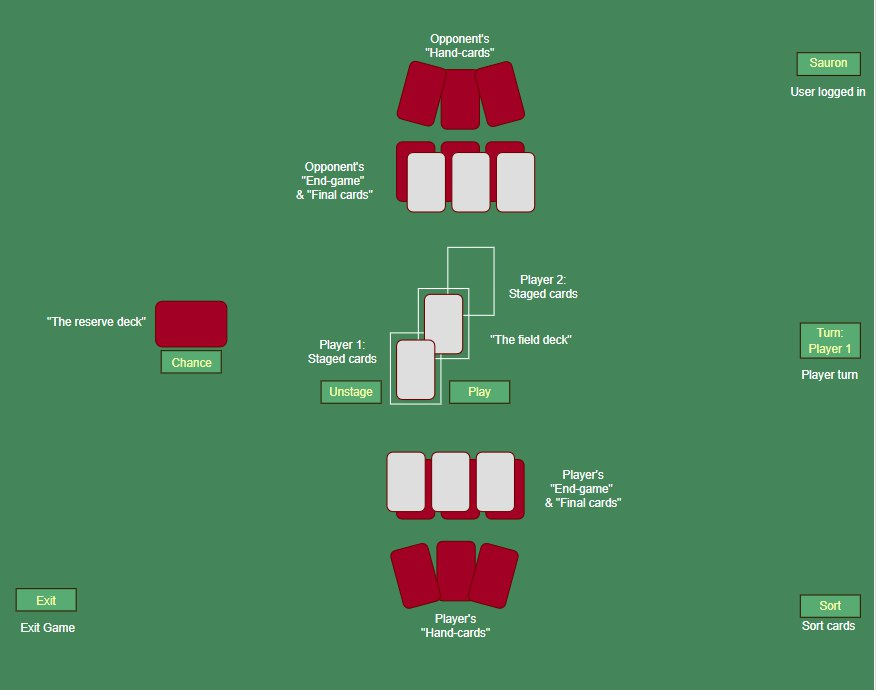

# Functional Specifications

## The idea with the program

The program is a moderately complex cardgame named "Bismarck". The game has many other names as well for example, "paska housu", "Chinahand" and surely many more. The rules will be layed out in greater detail in the "Rules" section. The idea is to create a digital version of this classic cardgame with a simple AI to play against. In the future the game might be upgraded to have a player vs. player option, but for simplicity's sake and due to time constraints this version will only have an AI. 

## Users

To begin with the game will only have "normal users". In the future, if the game will move online and statistics about games would be uploaded there might be need for some sort of an administrator who could access the statistics. But to begin with there will only be "normal users".

## The set up

The program consists of six different "landscapes". (Landscape = a menu or game page).
Landscape 1 will consist of a log in screen where the user will have to either "log in - entering a username and a password connected to an account" or "create an account". These two alternatives would lead to landscape 2 or 3. 
If the user chose "create an account" it would take him/her to andscape 2 which consists of three input lines and a finish button. The first input let's the user create a username and the second lets the user create a password. The third asks the user to reenter the password. When the user has entered the three input lines he/she can continue to landscape 3 by pressing the "create acccount" button below. 

Landscape 3 consists of the "main menu"-page. Here the user can press four different buttons. Button 1 (Play Game) lets the user play a game against the Bismarck AI. This is takes the player to landscape 4. Button 2 (Rules) on landscape 3 takes the player to landscape 5 which explains the game rules in detail. The page also has a button in the left corner which says "exit" which takes the player back to landscape 3. 

Button 3 (Ratingboard) gives the information on the top ten highest rated players that can be found from the local database. A player gets +15 rating for a win and -15 for a loss. 

The 4th and final button (exit) on the main menu (landscape 3) will take the user back to the login screen (landscape 1).    

## List of features in Bismarck program

The list is divided into categories and are noted *(implemented)* if implemented at the current stage.

### Features callable by the player
- Stage a card from hand
- Stage a card from endgame
- Play staged cards
- Pick up the field_deck
- Chance from reserve_deck
- Sort your hand of cards
- Play a Final_card

### Features used by the main Game

- class Card
	- a class modelling all cards in the game.
- class CreateDeck
	- a class that creates the deck that is used in the game.
- class Gameboard
	- a class that oversees the location of all cards during a game.
- class GameLogic
	- a class which restrics the players from doing illegal moves. It also oversees the phases of the game. I.E a "rulebook".
- class Player
	- a class which is used by a player to do any action.
- class BismarckAI
	- a class which functions as an AI which to play against.
### User
- class User
	- a class that keeps information about a user's username, password and current rating
- class UserControl
	- a class that oversees users on the local database. Through this class a player can log in, create an account. It also updates the rating of a 	user after a game. It also fetches the top ten highest rated players in the local database.

### GUI

- Login ui
- Create account ui
- Main menu ui
- Game ui
- Rules ui
- Ratingboard ui

## Rules

The game of Bismarck is a game of strategy where each player strives to win by being the first to have no cards left. This is done through o process described in the following chapter. First some important concepts and terminology will be introduced as to be able to smoothly describe different events. Concepts will be written in *itallic*.

### Concepts and terminogoly

*Hand-cards:* Each player has three *hand-cards* at the beginning of the game. At the end of each turn the player lifts x cards from *The Reserve* so that he/she has three *hand-cards*. If the player already has three or more *hand-cards* none will be lifted.

*The Reserve:* After the *initial dealing* (described later) of the cards the remainder of the cards will serve as *The Reserve* which is placed with the backside of the cards up on the game board. It will be used to fill each players' hand with up to three *Hand-cards*. A player can also choose to *chance* from *The Reserve* at any point.

*The Field:* *The field* is empty at the beginning of a game or after a player has *lifted*. When a player playes a card he/she places it on the field. If a card is sufficient is decided by the current top card on *the field*. Generally suffiency demands the played card's numeric value to be equal or higher than the current top card of *the field*. 

*Chance:* If the player doesn't want to play any of his/her *Hand-cards* the player can choose to *chance*. *Chancing* means lifting the top card from *The Pack* and playing that as his/her card. If the card is sufficient the turn goes over to the opposing player. If the card is not sufficient the player has to *lift* the *field pack*. 

*Lift:* The player has to lift *the field pack* if he has no cards that are sufficient. *Lifting* means that he will hold the entire *field pack* as *hand-cards* and won't be able to lift cards from *the reserve pack until he/she has less than three *hand_cards*. The player can choose to chance, but if this fails the player has to lift. The player can also chose to *lift* the pack at any time on his turn. 

*Final-cards:* At the *initial dealing* a set of randomly selected cards are dealt to the players as "Final-cards". These will be placed besides each other with the backside up. Only after the player has played all cards in his/her hand as well as his/her *End-game cards* can the player chose to play a *Final Card*.

*End-game cards:* At the *initial dealing* each player is deal a selection of six randomly selected cards. Out of these six cards the players choose three to place on top of the *final cars* with frontside up. These cards are called *End-game cards* and will be played when a player has no more *hand-cards* and *The reserve" is empty.

*Fallen:* Fallen cards are discarded and won't be part of the game after discardation. Cards fall when a player fells *the field pack* which can happen either by playing four cards of the same numeric value / by placing a number of cards with the same numeric value so that there are four cards of the same numeric value in direct succesive order on *the field pack* or by playing a 10 (special card).

*Special cards:* There are three *special cards cards which main power is not derived from their numeric value. These cards are suffiecnt against any other card no matter it's numeric value and have a special effect to them. The first *special card* is the 2 which resets numeric value on top of *the field pack* (everything can be played on the 2). The second *special card* is the 10 which fells the pack. After the pack has been felled the player can play a card on a clear field before ending his/her turn. The third and last special card is *the Joker* of which there are only two compared to all other cards of which there are a total of four. In contrast to all which has to have the same numeric value to be played together *the Joker* can be played with any other card *mirroring* what's under it.

These are the core parts of the game of Bismarck. In the next subchapter more specific rules are explained. Due to much of the game rules being tied up to the concepts explained above the amount of actual rules are quite low.

Rule 1. Each player needs to do either of three things each turn. 

a.) Play one or many cards with the same numeric value. The only exception to this is *the Joker* which can be played alone or together with any card. If the played card/cards are sufficient the player will lift x amount of cards from *the Pack* so that he/she has three *hand-cards*. If the cards played are not sufficient the player *lifts* the *field pack*. 
	
b.) If the player doesn't want to play any of his *hand-cards* he can choose to *chance*.

c.) The last option is to *lift* the *field pack*.

After this the turn moves to the opposing player.

Rule 2. A player can always *lift* or *chance* even though he would have sufficient *hand-cards* to play.

## Skiss of User Interface

### All the different landscapes.

### User interface when playing a game of Bismarck

