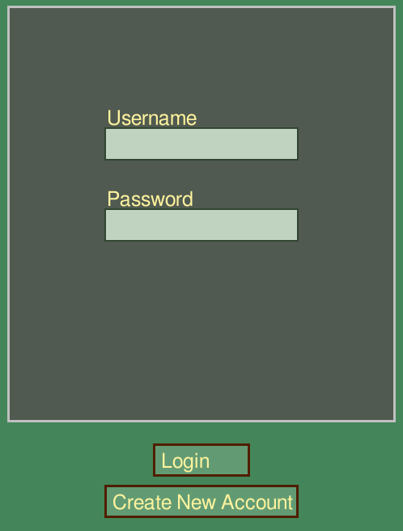

# Instructions

Download the latest [release](https://github.com/ohjelmistotekniikkahttps://github.com/Catrovitch/ot-harjoitustyo/releases) by clicking on the link and then navigating to the flip down menu "Assets". Scroll down and choose the option "Source code (zip)" which downloads a the project. Extract it to your prefered folder.

## Configuration

to be completed

## Starting the program

Before starting the program you should navigate in your terminal to the project main folder named "ot-harjoitustyo" and perform the command "poetry install" which installs all dependencies needed to run the program. After this you are ready to start the actual program with the command "poetry run invoke start".

1. Run this command inside the project folder.

```bash
poetry install
```

2. Run this command to initialize or reset the database used in the program.

```bash
poetry run invoke build
```

3. Run this command to start the program.

```bash
poetry run invoke start
```

## Log in

When you start the program for the first time you need to create an account. The program asks for a username and a password. Both the username and password can use any combination of upper/lowercase letters, numbers and characters in "!"¤%&/()=?". Max length for both username and password is 16 characters. The username needs to be unique which the program checks automatically. The password needs to be entered two times and they need to match. After this you click the "create account button" which creates an account according to the information you have just entered and logs you in automatically.

If you already have an account you can log in straight away by entering your username and password and then clicking the "login button".

### Picture of login screen


### Picture of account creation screen

