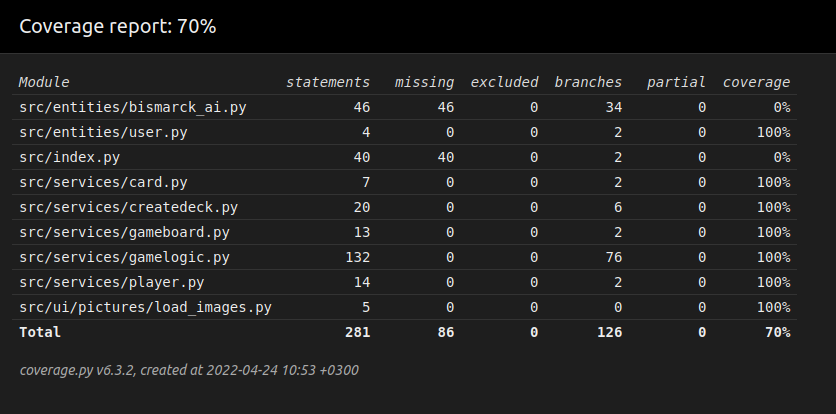

# Testing documentation

Here documentation about testing will be kept and updated during the development of this project.

## Coverage Rapport

### Updated 15.5.2022
As of this moment most of the classes have been covered. However some are still lacking in tests and will be fixed in the future. Due to this project growing much larger than I had intizipated my architecture came to be suboptimal. In most cases it worked fine, but in certain cases it messed with my testing. I am going to remake the whole project in the comming months and fix these issues. 

