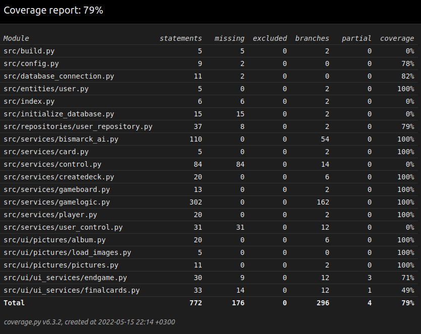

# Testing documentation

Here documentation about testing will be kept and updated during the development of this project.

## Coverage Rapport

### Updated 24.4.2022
As of this moment proper tests have been developed for classes: Card, CreateDeck, GameBoard, GameLogic, Player and User. When testing the method shuffle from the class CreateDeck the test fails at rare cases. This is due to it testing what the top card is after the shuffle. Against all odds this should not be the same as before the shuffle, however at rare cases this happens which makes the test fail. The current iteration of index.py is only a filler function to be used when testing the game as implemented to this point and will be iterated on when the game expands.

